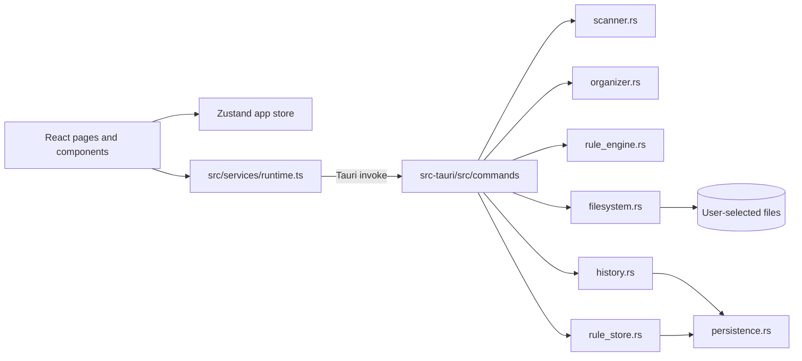

# Smart Organizer

English | [简体中文](./README.zh-CN.md)

A Windows-first desktop file organizer that lets you scan, preview, apply, and undo file moves locally.

## Overview

Smart Organizer is a Tauri 2 application for people who want to clean a folder without handing control of their files to opaque automation. It reads metadata first, generates an explicit plan, requires confirmation before changing files, records each transaction, and supports undo when the original paths are still available.

The project is currently an MVP. The core scan → plan → apply → history → undo workflow is implemented, while settings, recursive scanning, rename rules, and a general natural-language parser remain planned work.

## Features

- Scan the selected folder's immediate file children without opening or changing them.
- Classify known extensions as Images, Videos, Documents, Archives, Audio, Code, or Applications.
- Skip directories, hidden/system entries, symbolic links, and special files; unknown files remain `Other`.
- Generate a preview-only organization plan with conflict-safe destination names such as `file (1).txt`.
- Apply only the operations selected in the preview; existing destinations are never overwritten silently.
- Validate source and destination paths so operations stay inside the selected root.
- Save enabled move rules locally and apply the first matching rule before category fallback.
- Keep local transaction history, including partial failures, and undo completed moves without overwriting a conflicting source.
- Persist rules and history with recoverable JSON backups in the Tauri application data directory.

## Demo / Screenshots

No screenshots are committed yet. The application is a local desktop UI; a `screenshots/` directory can be added when stable release captures are available.

## Tech Stack

- **Desktop:** Tauri 2
- **Frontend:** React 19, TypeScript, Vite 6
- **Backend:** Rust 2021
- **State:** Zustand 5
- **Serialization:** Serde and JSON
- **Testing:** Vitest for frontend state; Rust unit tests for scanner, planner, filesystem, rules, and persistence
- **Package/build tools:** pnpm, Vite, Cargo, Tauri CLI

## Architecture



The frontend owns presentation and transient state. Rust owns scanning, rule evaluation, path validation, file operations, transactions, and persistence. Plans are generated before execution, and the filesystem boundary rejects out-of-root paths and existing destinations.

## Project Structure

```text
smart-organizer/
├── src/                 # React entry point, pages, components, state, runtime adapters, types
├── src-tauri/src/       # Rust commands and domain modules
├── src-tauri/resources/ # Extension category catalog
├── src-tauri/icons/     # Tauri application icons
├── tests/               # Frontend Vitest tests
├── docs/                # Verified project state, backlog, and iteration reports
├── package.json         # pnpm scripts and frontend dependencies
└── src-tauri/Cargo.toml # Rust dependencies and crate configuration
```

## Getting Started

### Prerequisites

- Windows for the intended native desktop workflow
- Node.js with pnpm available
- Rust with the MSVC toolchain
- Visual Studio C++ build tools for native Tauri development

### Installation

```powershell
git clone https://github.com/MountCoder-merry/smart-organizer.git
cd smart-organizer
pnpm install
```

### Development

Use the native shell for real filesystem behavior:

```powershell
pnpm tauri dev
```

`pnpm dev` starts the Vite browser preview at `http://127.0.0.1:1420`; native Tauri commands are not fully available in a plain browser preview.

### Testing and Build

```powershell
pnpm test
pnpm typecheck
pnpm build
cargo fmt --manifest-path src-tauri/Cargo.toml -- --check
cargo test --manifest-path src-tauri/Cargo.toml
pnpm tauri build --no-bundle
```

The last command performs an offline native release build after dependencies are available. Packaging may require platform-specific WiX/NSIS tooling.

## Available Scripts

| Script | Purpose |
| --- | --- |
| `pnpm dev` | Start the Vite browser preview on port 1420. |
| `pnpm build` | Run the TypeScript project build and create the Vite production bundle. |
| `pnpm preview` | Serve the built frontend bundle locally. |
| `pnpm typecheck` | Run TypeScript checking without emitting files. |
| `pnpm test` | Run the Vitest suite once. |
| `pnpm tauri ...` | Forward a command to the Tauri CLI, such as `pnpm tauri dev`. |

There is currently no lint script or CI workflow.

## Usage

1. Open **Organize** and choose a test folder.
2. Run **Scan** to read its first-layer metadata.
3. Review the generated plan and deselect any operation you do not want.
4. Apply the selected moves.
5. Open **History** to inspect the transaction or undo it.
6. Create a move rule under **Rules**; matching enabled rules take precedence over category folders.

For safe testing, use a disposable folder. Rename rules are currently rejected, and the natural-language parser only recognizes the documented screenshot and large-video examples.

## Design Decisions

- **Plan before execution:** scanning and planning never mutate user files.
- **Rust owns the filesystem:** the React layer requests typed commands but cannot bypass path validation.
- **No silent overwrite:** conflicts fail as individual operations and remain visible in the transaction.
- **Recoverable local state:** history and rules use synced temporary writes with backup fallback.
- **Deterministic rules:** enabled rules are evaluated in saved order; the first match wins, then category fallback is used.

## Current Status

The MVP workflow is functional and locally testable. Current limitations include first-layer-only scanning, two-example natural-language parsing, unsupported rename rules, placeholder Settings, hard-coded activity timestamps, and no end-to-end UI test suite.

## Roadmap

### Completed

- First-layer metadata scanning and category planning
- Preview, selective apply, conflict protection, transaction history, and undo
- Persisted move rules with deterministic matching
- Recoverable local JSON persistence

### In Progress

No separate in-progress feature is declared at this time.

### Planned

- End-to-end coverage for scan → plan → apply → history → undo
- Recursive scanning with an explicit safety policy
- Implemented rename-rule semantics
- Broader natural-language rule parsing
- Settings for scan and conflict preferences
- CI, linting, and release automation

## Testing

The repository currently has 3 frontend Vitest tests and 14 Rust unit tests. Frontend tests cover Zustand workflow state; Rust tests cover scanning, category planning, rule evaluation, file application/undo, conflict handling, and persistence recovery.

Run `pnpm test` and `cargo test --manifest-path src-tauri/Cargo.toml` before submitting changes. There is no lint command configured yet.

## Contributing

1. Create a focused branch from `main`.
2. Keep changes small and preserve the plan-first, no-overwrite safety invariants.
3. Add or update tests for behavior changes.
4. Run typecheck, frontend tests, Rust tests, formatting checks, and the production build.
5. Open a pull request describing the user-visible behavior, affected frontend/backend modules, validation commands, and any platform-specific limitations.

## License

License has not been specified yet.
