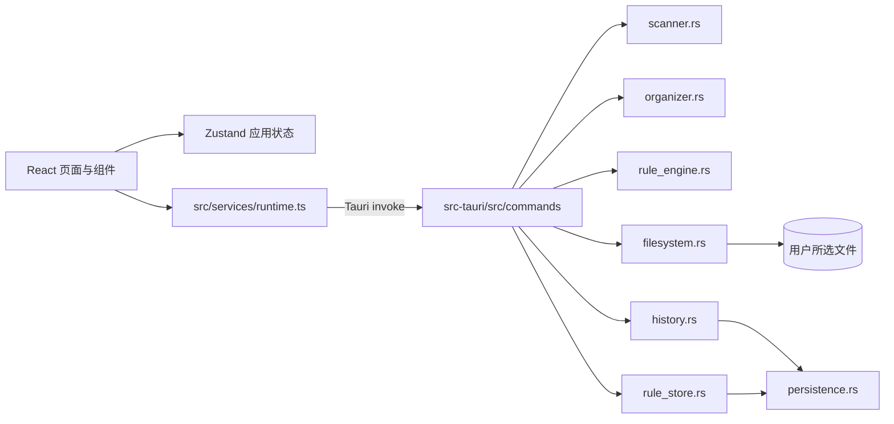

# Smart Organizer

[English](./README.md) | 简体中文

一款 Windows 优先的桌面文件整理工具：先扫描和预览，再执行移动，并支持本地撤销。

## 项目简介

Smart Organizer 是一个基于 Tauri 2 的桌面应用，面向希望整理文件、但不愿让不可见自动化直接改动文件的用户。应用先读取元数据并生成明确的整理计划，用户确认后才执行文件操作；每次操作都会记录为本地交易，并在原路径仍可用时支持撤销。

项目当前处于 MVP 阶段。扫描 → 计划 → 执行 → 历史 → 撤销的核心流程已经实现；设置、递归扫描、重命名规则和通用自然语言解析仍属于计划功能。

## 功能特性

- 仅读取所选目录的第一层普通文件，不打开或修改文件内容。
- 将已知扩展名归类为图片、视频、文档、压缩包、音频、代码或应用程序。
- 跳过目录、隐藏/系统文件、符号链接和特殊文件；未知文件归为 `Other`。
- 生成仅用于预览的整理计划，并用 `file (1).txt` 等方式处理目标冲突。
- 只执行预览中选中的操作，不会静默覆盖已有目标文件。
- 校验源路径和目标路径，确保操作始终位于所选根目录内。
- 在本地保存启用的移动规则；首个匹配规则优先于默认分类目录。
- 保存本地交易历史，记录部分失败，并在源路径没有冲突时撤销已完成移动。
- 使用可恢复的 JSON 备份保存规则和历史记录。

## Demo / 截图

当前仓库尚未提交截图。应用是本地桌面 UI；稳定版本截图准备好后，可以增加 `screenshots/` 目录。

## 技术栈

- **桌面端：** Tauri 2
- **前端：** React 19、TypeScript、Vite 6
- **后端：** Rust 2021
- **状态管理：** Zustand 5
- **序列化：** Serde、JSON
- **测试：** 前端 Vitest；Rust 单元测试覆盖扫描、计划、文件操作、规则和持久化
- **包与构建：** pnpm、Vite、Cargo、Tauri CLI

## 架构



前端负责界面和临时状态；Rust 负责扫描、规则计算、路径校验、文件操作、交易和持久化。所有文件操作都必须先生成计划，文件系统边界会拒绝越出根目录的路径和已存在的目标文件。

## 项目结构

```text
smart-organizer/
├── src/                 # React 入口、页面、组件、状态、运行时适配器和类型
├── src-tauri/src/       # Rust 命令层和领域模块
├── src-tauri/resources/ # 扩展名分类目录
├── src-tauri/icons/     # Tauri 应用图标
├── tests/               # 前端 Vitest 测试
├── docs/                # 项目状态、改进 backlog 和迭代报告
├── package.json         # pnpm 脚本和前端依赖
└── src-tauri/Cargo.toml # Rust 依赖和 crate 配置
```

## 快速开始

### 环境要求

- Windows（当前原生桌面工作流的目标平台）
- 可用的 Node.js 和 pnpm
- MSVC 工具链对应的 Rust
- 用于原生 Tauri 开发的 Visual Studio C++ 构建工具

### 安装

```powershell
git clone https://github.com/MountCoder-merry/smart-organizer.git
cd smart-organizer
pnpm install
```

### 开发运行

要使用真实文件系统能力，请运行原生桌面端：

```powershell
pnpm tauri dev
```

`pnpm dev` 会在 `http://127.0.0.1:1420` 启动 Vite 浏览器预览；单独运行浏览器预览时无法完整使用 Tauri 原生命令。

### 测试与构建

```powershell
pnpm test
pnpm typecheck
pnpm build
cargo fmt --manifest-path src-tauri/Cargo.toml -- --check
cargo test --manifest-path src-tauri/Cargo.toml
pnpm tauri build --no-bundle
```

最后一个命令会在依赖已经准备好后执行不打包的原生 release 构建。完整安装包可能还需要对应平台的 WiX/NSIS 工具。

## 可用脚本

| 脚本 | 用途 |
| --- | --- |
| `pnpm dev` | 在 1420 端口启动 Vite 浏览器预览。 |
| `pnpm build` | 执行 TypeScript 项目构建并生成 Vite 生产包。 |
| `pnpm preview` | 本地预览已构建的前端包。 |
| `pnpm typecheck` | 执行 TypeScript 检查，不生成文件。 |
| `pnpm test` | 执行一次 Vitest 测试。 |
| `pnpm tauri ...` | 转发命令到 Tauri CLI，例如 `pnpm tauri dev`。 |

当前尚未配置 lint 脚本或 CI 工作流。

## 使用方式

1. 打开 **Organize**，选择一个测试目录。
2. 点击 **Scan**，读取该目录第一层元数据。
3. 查看生成的计划，取消勾选不希望执行的操作。
4. 执行选中的移动操作。
5. 在 **History** 中查看交易或撤销操作。
6. 在 **Rules** 中创建移动规则；匹配成功的启用规则优先于分类目录。

建议使用临时目录测试。当前重命名规则会被拒绝，自然语言解析器只识别文档中说明的截图和大视频示例。

## 设计说明

- **先计划后执行：** 扫描和生成计划不会修改用户文件。
- **Rust 负责文件系统：** React 只能请求强类型命令，不能绕过路径校验。
- **不静默覆盖：** 冲突作为独立失败操作记录在交易中。
- **本地状态可恢复：** 历史和规则使用同步临时写入与备份回退。
- **规则确定性：** 按保存顺序计算启用规则，首个匹配规则生效，否则使用分类兜底。

## 当前状态

MVP 核心流程已经可以本地运行和验证。当前限制包括：只扫描第一层、自然语言解析仅支持两个示例、尚未支持重命名规则、Settings 仍是占位页、活动时间仍硬编码为 `Just now`，并且还没有完整的端到端 UI 测试。

## 路线图

### 已完成

- 第一层元数据扫描和分类计划
- 计划预览、选择性执行、冲突保护、交易历史和撤销
- 具备确定性匹配的本地移动规则
- 可恢复的本地 JSON 持久化

### 进行中

当前没有单独声明的进行中功能。

### 计划中

- 覆盖扫描 → 计划 → 执行 → 历史 → 撤销的端到端测试
- 在明确安全策略后支持递归扫描
- 实现重命名规则语义
- 扩展自然语言规则解析
- 增加扫描和冲突偏好设置
- 增加 CI、lint 和发布自动化

## 测试

当前仓库包含 3 个前端 Vitest 测试和 14 个 Rust 单元测试。前端测试覆盖 Zustand 工作流状态；Rust 测试覆盖扫描、分类计划、规则计算、文件执行/撤销、冲突处理和持久化恢复。

提交修改前请运行 `pnpm test` 和 `cargo test --manifest-path src-tauri/Cargo.toml`。项目目前尚未配置 lint 命令。

## 贡献

1. 从 `main` 创建聚焦的开发分支。
2. 保持修改小而明确，并维护先计划、不覆盖的安全约束。
3. 为行为变化增加或更新测试。
4. 运行类型检查、前端测试、Rust 测试、格式检查和生产构建。
5. 创建 Pull Request，说明用户可见变化、受影响的前后端模块、验证命令以及平台限制。

## License

项目目前尚未指定许可证。
